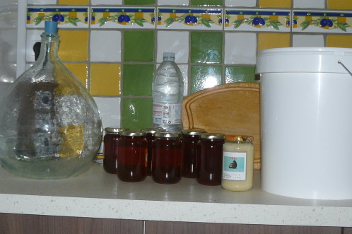
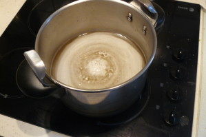
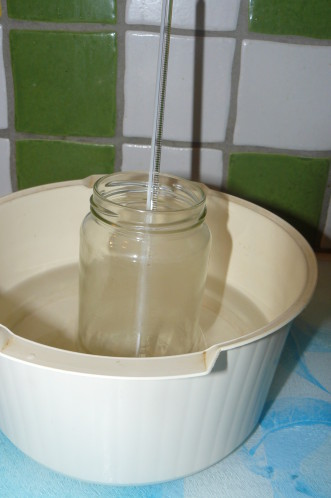
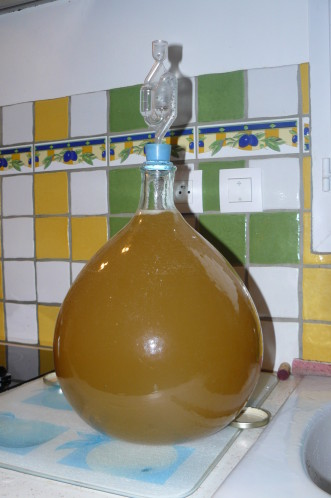

# Protocole de fabrication d'Hydromel

## Ingrédients

|         ingrédient         |     proportion     |
|----------------------------|--------------------|
|           Miel             |  350g/L pour 14°   |
|       Acide tartrique      |        1g/L        |
|       Acide citrique       |       ::TODO       |
|       Sels nourricier      |       0,4g/L       |
|            Eau             | 750ml / Kg de miel |
| metabisulfite de potassium |       0.1g/L       |
|       Bioferm killer       |       ::TODO       |

## Matériel

* Cuve
* Bouchon troué
* barboteur

## Ustensiles

* Casserole > 5 Litre
* Casserole > 1 Litre
* Balance de précision >= mg
* Entonnoir
* Film plastique
* Bocal de confitureen verre
* Elastique
* Thermomètre
* Becher gradué > 1L
* Pipette graduée
* Poire à pipeté
* ::TODO chercher un moyen de mesuré l'alcool sans perte

## Les bases du calcul sont les suivantes:

Le manque d'acidité du miel sera corrigé avec de l'acide tartrique ( entre 0,7 et 1 g/L )  Ce miel étant peu acide, je choisis 1g/L donc 10 g d'acide tartrique . Idéalement il faut un pH voisin de 3,5

## Etapes de fabrication

### Pied de cuve

* Pied de cuve  
  - ~20% du volume totale
* Mélanger à chaud ( 40°C max ), puis à température ambiante dans la cuve

>Le pied de cuve se développera mieux aux alentours de 22°C.

### Hydratation de la levure le jour J

* Les levures sont délayées dans 10 fois leurs volume d'eau à température ambiante
* On chauffe le mélange à bain Marie en couvrant avec un film plastique
* Après 1/2 heure, de la condensation et une mousse devraient apparaître sur le film.
* Quand les deux liquides sont redescendus à température ambiante:
  - Verser le mou dans la cuve + 0.8g de sel nutritif
  - Aèré le pied de cuve en l'agitant plusieurs fois par jour durant 4 jours

### Fermentation du moût à J+4

* Verifier la présence des levures
  - Odeurs de levure
  - Pssshhhtt produit lors de l'agitation de la cuve
  - Mousse en surface
* Ajout du reste du miel, acide tartrique et les nutriments en suivant les proportions
* Cuve = pied de cuve + Ajout précedent
* Mélanger doucement
* Ajuster le niveau avec de l'eau
* Placer le barboteur rempli d'eau enrichie en Métabisulfite de Potassium et Acide Citrique

### Fin de fermentation

* Mesurer la densité du mélange après environ 6 semaines
* Si densité a 1Kg/L : tuer les levures
* Si mélange sec, ajouter miel

Le lendemain:
* Vérifier la non présence de bulles (fermentation arretée)
* Rajouter 0,1g/L de Métabisulfite de Potassium (désinfectant alimentaire)

### Clarification et élevage

Les étape suivantes: Bentonitage à 60g/hL au froid puis soutirage aprés deux semaines
Bentonitage : Élimination des protéines du moût par addition de bentonite.

Sulfitage 0,5 g

Décantation au froid sur sa lie pendant plusieurs mois puis ... peut être mise en bouteilles si le produit est clair.

::TODO clarifier ce procédé
